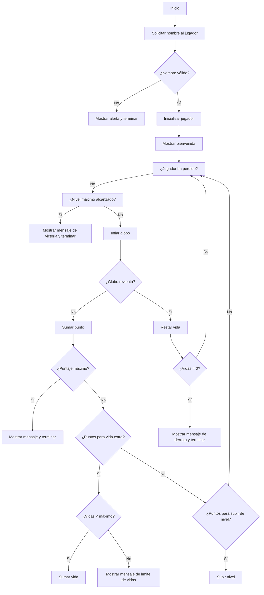

# Tarea M3-AE2-individual

```mermaid
flowchart TD
    A[Inicio] --> B[Solicitar nombre al jugador]
    B --> C{¿Nombre válido?}
    C -- No --> D[Mostrar alerta y terminar]
    C -- Sí --> E[Inicializar jugador]
    E --> F[Mostrar bienvenida]
    F --> G[¿Jugador ha perdido?]
    G -- No --> H[¿Nivel máximo alcanzado?]
    H -- Sí --> I[Mostrar mensaje de victoria y terminar]
    H -- No --> J[Inflar globo]
    J --> K{¿Globo revienta?}
    K -- No --> L[Sumar punto]
    L --> M{¿Puntaje máximo?}
    M -- Sí --> N[Mostrar mensaje y terminar]
    M -- No --> O{¿Puntos para vida extra?}
    O -- Sí --> P{¿Vidas < máximo?}
    P -- Sí --> Q[Sumar vida]
    P -- No --> R[Mostrar mensaje de límite de vidas]
    O -- No --> S{¿Puntos para subir de nivel?}
    S -- Sí --> T[Subir nivel]
    S -- No --> G
    K -- Sí --> U[Restar vida]
    U --> V{¿Vidas = 0?}
    V -- Sí --> W[Mostrar mensaje de derrota y terminar]
    V -- No --> G
```