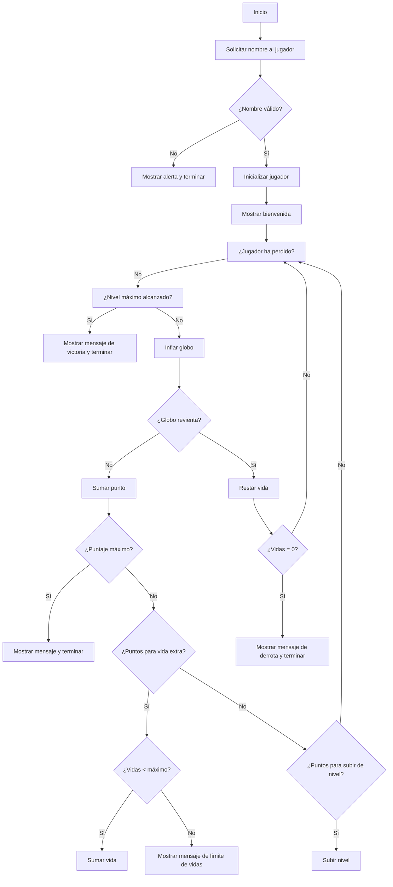

# Tarea M3-AE2-individual

## Contexto y actividad

Imagina que estás desarrollando el sistema de puntuación de un minijuego en JavaScript. Este juego es muy simple: el jugador acumula puntos cada vez que realiza una acción, puede tener vidas extra según ciertas condiciones y recibe mensajes diferentes dependiendo del puntaje. Para esto, necesitas usar variables, operadores, estructuras condicionales y tipos de datos para modelar el comportamiento del juego.

Para cumplir con lo anterior, desarrolla un programa en JavaScript que simule el sistema de puntuación de un juego aplicando los siguientes conceptos:

- Crea variables que representen el nombre del jugador, su puntuación inicial, número de vidas y nivel.
- Utiliza nombres claros y significativos para tus variables.
- Declara una constante que indique el puntaje necesario para ganar una vida extra.
- Usa tipos de datos simples (`string`, `number`, `boolean`) y tipos complejos (arrays, objetos) para organizar los datos del jugador.
- Implementa una función que simule una jugada:
    - Suma puntos al jugador.
    - Aumenta el nivel si el puntaje supera cierto umbral.
    - Muestra un mensaje con el estado actual del jugador usando concatenación de cadenas.
- Usa operadores aritméticos, de incremento/decremento, y de comparación para actualizar el estado del juego.
- Implementa la lógica con `if` y `else` para evaluar:
    - Si el jugador ha ganado una vida extra.
    - Si ha alcanzado el puntaje máximo.
    - Si debe finalizar el juego por quedarse sin vidas.
- Incluye al menos un diagrama de flujo sencillo (dibujado o explicado textualmente) que represente la lógica que implementaste.
- Asegúrate de manejar condiciones de borde, como puntaje negativo, exceso de vidas o valores inválidos.

## Explicación del juego

El juego simula la acción de inflar globos, donde el jugador acumula puntos y puede ganar vidas extra o subir de nivel según su desempeño. Al iniciar, se solicita el nombre del jugador y se inicializan sus datos: puntos, vidas y nivel.

- En cada turno, el jugador intenta inflar un globo. Existe una probabilidad creciente (según el nivel) de que el globo reviente.
- Si el globo no revienta, el jugador suma un punto. Al alcanzar ciertos puntos, puede ganar una vida extra (si no ha llegado al máximo) y subir de nivel.
- Si el globo revienta, el jugador pierde una vida. El juego termina si el jugador se queda sin vidas, alcanza el puntaje máximo o llega al nivel máximo.

## Diagrama de flujo


## Reflexión

- ¿Cómo influyó el **scope** de las variables en el diseño de tu función?

    El scope de las variables permitió organizar el código de forma clara, asegurando que los datos del jugador y las constantes del juego fueran accesibles tanto dentro como fuera de la función principal. Esto facilitó la actualización del estado del juego y el uso de funciones auxiliares sin conflictos ni duplicidad de información.

- ¿Cuál fue el operador más útil y por qué?

    Los operadores más útiles fueron los de comparación (`===`, `<`, `>`) porque permitió evaluar condiciones clave en el juego, como determinar si el jugador ha alcanzado el puntaje necesario para ganar una vida extra, subir de nivel, perder una vida o finalizar el juego.

- ¿En qué parte del código implementaste una validación para manejar un **caso límite**?

    En el código se implementa una validación para manejar el caso límite de vidas negativas dentro de la función `play`, específicamente en esta línea:
    ```js
    if (player.lives < 0) player.lives = 0;
    ```
    Esto asegura que el número de vidas del jugador nunca sea negativo, manteniendo la lógica del juego coherente y evitando errores en el flujo del juego.